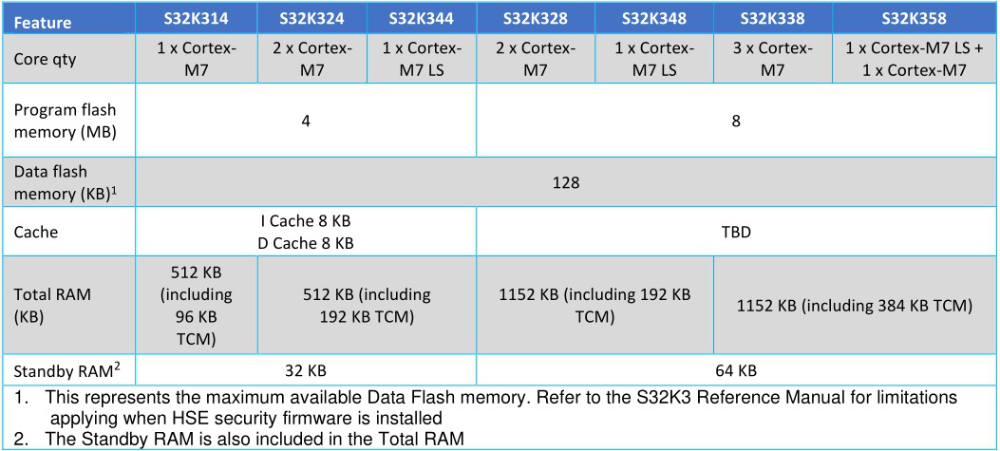
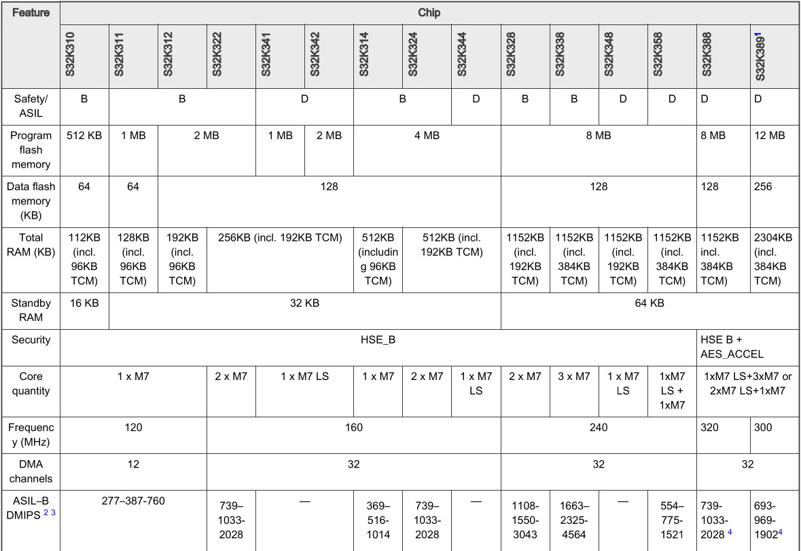
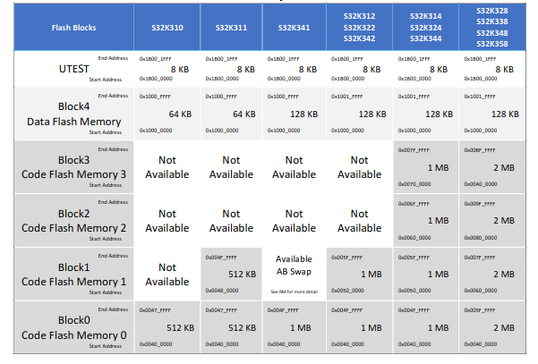
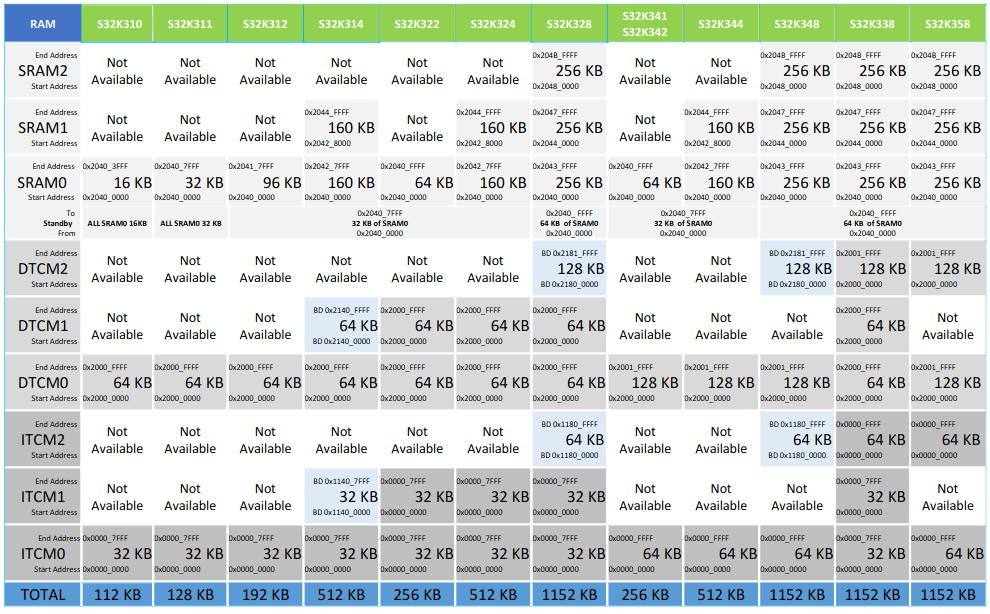
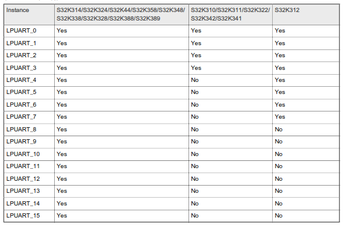
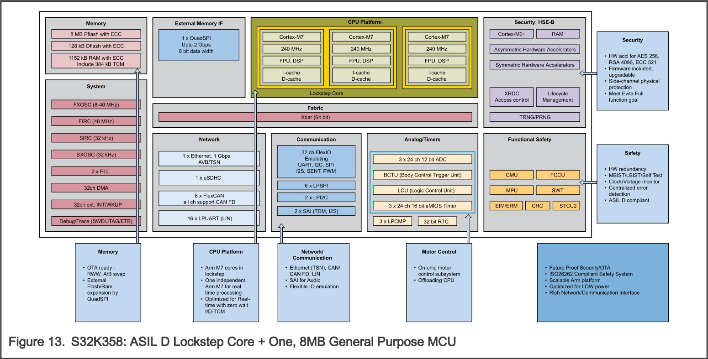

# Secure-Timeout-System-NXPS32K3X8EVB


<!-- ## Table of Contents -->

<details closed>
<summary><b>Table of Contents</b></summary>
 
&nbsp;• [Project Overview](#project-overview) <br>
&nbsp;• [Features](#features) <br>
&nbsp;• [Getting Started](#getting-started) <br>
&nbsp;&nbsp;&nbsp;&nbsp;&nbsp;• [Prerequisites](#prerequisites) <br>
&nbsp;&nbsp;&nbsp;&nbsp;&nbsp;• [Installation](#installation) <br>
&nbsp;&nbsp;&nbsp;&nbsp;&nbsp;• [Running the Emulator and the Application](#running-the-emulator-and-the-application) <br>
&nbsp;• [Guide for Recreating the Project](#guide-for-recreating-the-project) <br>
&nbsp;• [Project Structure](#project-structure) <br>
&nbsp;• [Board Specifications](#board-specifications) <br>
&nbsp;&nbsp;&nbsp;&nbsp;&nbsp;• [Memory](#memory) <br>
&nbsp;&nbsp;&nbsp;&nbsp;&nbsp;• [Peripherals](#peripherals) <br>
&nbsp;• [FreeRTOS Application](#freertos-application) <br>
&nbsp;&nbsp;&nbsp;&nbsp;&nbsp;• [Available Configuration Options](#available-configuration-options) <br>
&nbsp;• [Memory Protection Unit (MPU) Implementation](#memory-protection-unit-mpu-implementation) <br>
&nbsp;• [Team Collaboration](#team-collaboration) <br>
&nbsp;• [Contributing](#contributing) <br>
&nbsp;• [Authors](#authors) <br>
&nbsp;• [License](#license) <br>
&nbsp;• [Acknowledgments](#acknowledgments) <br>

<div align="right">
<i>Last updated: January 2025</i>
</div>

</details>

## Project Overview

This project implements a very simple Secure Timeout System application on the **NXP S32K3X8EVB** board using **FreeRTOS**, emulated with **QEMU**.

This project has been assigned for the [Computer Architectures and Operating Systems](https://didattica.polito.it/pls/portal30/gap.pkg_guide.viewGap?p_cod_ins=01GYKUV&p_a_acc=2025&p_header=S&p_lang=IT&multi=N) course at **Politecnico di Torino**. The work has been carried out by **group 2**. For more information about the authors, please refer to the [Authors](#authors) section.

- Original Project Repository: [neo-CAOS/Secure-Timeout-System-NXPS32K3X8EVB](https://github.com/neo-CAOS/Secure-Timeout-System-NXPS32K3X8EVB)  
- Original Beamer Repository: [neo-CAOS/latex-beamer](https://github.com/neo-CAOS/latex-beamer)

## Features

- **Integration with FreeRTOS**: Seamlessly integrates with the FreeRTOS real-time operating system.
- **UART Communication**: Supports UART communication for serial data transmission.
- **Hardware Timer Initialization and Handling**: Initializes and handles hardware timers efficiently.
- **Secure Timeout System with Multiple Tasks**: Implements a secure timeout system capable of managing multiple tasks.
- **QEMU Emulation Support**: Provides support for QEMU emulation to facilitate testing and development.

## Getting Started

### Prerequisites

- A **Linux-based** operating system (e.g., Ubuntu)
- **Git** for version control
- **QEMU** for hardware emulation
- **FreeRTOS** for the real-time operating system
- **ARM GCC Toolchain** (`gcc-arm-none-eabi`) for compiling the code
- **Make** for building the project
- **Ninja build** system for building QEMU

### Installation

Clone the repository:
```sh
git clone --recurse-submodules https://baltig.polito.it/caos2024/group2.git 
cd group2
```

### Running the Emulator and the Application

1. To configure and build **QEMU**, just do:
   ```bash
   cd App
   make qemu_build
   ```
   This implicitly does `make qemu_configure qemu_ninja`.

2. To run the **App**:
    ```sh
    make run
    ```
    This implicitly does `make clean all qemu_start`.

3. To run the App in **debug** mode:
    ```sh
    make qemu_debug
    ```
    This starts QEMU in debug mode, allowing you to connect a debugger like **GDB**.

> There is also a command to build and run:
>   ```sh
>   cd App
>   make jesus
>   ```

> For `make jesus` and `make qemu_build`, there are "verbose" versions that print the logging of the build of the board:
>   ```sh
>   make qemu_build_v
>   make jesus_v
>   ```

## Guide for Recreating the Project

For a detailed guide on setting up, running, and recreating the project, refer to the [`GUIDE.md`](GUIDE.md) file. This guide provides comprehensive instructions and explanations of all the steps and details involved in the project.

## Project structure

- `App/`: Contains the main project files and source code.
    - `CMSIS/`: CMSIS headers and startup files.
    - `MPU/`: MPU files.
    - `Peripherals/`: Contains peripheral driver files.
        - `IntTimer.c/.h`: Timer interrupt handling.
        - `uart.c/.h`: UART communication functions.
    - `SecureTimeoutSystem/`: Contains the secure timeout system implementation.
        - `globals.h`: Global variables for the secure timeout system.
        - `secure_timeout_systems.c/.h`: Secure timeout system functions.
    - `FreeRTOSConfig.h`: FreeRTOS configuration file.
    - `main.c`: Main application entry point.
    - `Makefile`: Build configuration and rules.
    - `s32_linker.ld`: Linker script for the project.
    - `s32_startup.c`: Startup code for the S32K3X8EVB board.
- `FreeRTOS/`: FreeRTOS kernel and related files.
- `qemu/`: QEMU emulator files.
- `resources/`: Additional resources such as images and documentation.
- `scripts/`: Collection of scripts used in the project.
- `README.md`: Project documentation.
- `GUIDE.md`: Detailed guide for setting up, running, and recreating the project, explaining all the steps and details.
- `LICENSE`: License file.

## Board Specifications

The specific board that we are implementing and should refer to is the **`S32K358EVB`**.

<!--  -->

### Cores

The `S32K358EVB` board has **two cores**: 1 x `Cortex-M7` (`CM7_0`) and 1 x `Cortex-M7 LS` (`CM7_2`).

<!--  -->
 [^1]

[^1]: Image taken from the manual [`S32K3XXRM.pdf`](resources/datasheets/S32K3XXRM.pdf), page 52.

### Clocks

- **Primary System Clock**: `240MHz` frequency, 4.16ns period.
- **AIPS Platform Clock**: `80MHz`
- **AIPS Slow Clock**: `40MHz`
- **Reference Clock**: `1MHz`

<!--  -->

### Memory

###### **Flash Memory Layout**

The board is equipped with multiple blocks of flash memory, each with specific starting addresses and sizes. Here is an overview of the memory blocks:

  - **Block 0**: 2 MB at `0x00400000`
  - **Block 1**: 2 MB at `0x00600000`
  - **Block 2**: 2 MB at `0x00800000`
  - **Block 3**: 2 MB at `0x00A00000`
  - **Block 4**: 128 KB at `0x10000000`
  - **Utest**: 8 KB at `0x1B000000`

The following picture provides a detailed overview of the **FLASH** memory layout. Refer to the last column for the implementation that was used for the project.

 [^2]

[^2]: Image taken from the manual [`AN13388.pdf`](resources/datasheets/AN13388.pdf), page 3.

###### **SRAM,DTCM,ITCM Memory Layout**

The board features several blocks of SRAM and additional DTCM and ITCM block, each one starting at a specific address.

###### **SRAM Layout**:

  - **Block 0**: 256 KB at `0x20400000`
  - **Block 1**: 256 KB at `0x20440000`
  - **Block 2**: 256 KB at `0x20480000`
  
###### **DTCM Memory Blocks**:

  - **DTCM0**: 128 KB at `0x20000000`
  - **DTCM2**: 128 KB at `0x21800000`
  
###### **ITCM Memory Blocks**:
 
  - **ITCM0**: 64 KB at `0x00000000`
  - **ITCM2**: 64 KB at `0x00010000`
  
The layout is shown in the image below for reference. Refer to the last column for the implementation that was used for the project.

 [^3]

[^3]: Image taken from the manual [`AN13388.pdf`](resources/datasheets/AN13388.pdf), page 13.

### **MPU**

The **MPU** is configured with **16 memory regions**, split across **2 blocks**.

### **NVIC**

NVIC (Nested Vectored Interrupt Controller):
- Configured with **4 priority bits** and **256 IRQs**:
  - `1` Initial Stack Pointer value (-16)
  - `15` System Exceptions
  - `240` External Interrupts

<!--  -->
 [^4]

[^4]: Image taken from the manual [`S32K3XXRM.pdf`](resources/datasheets/S32K3XXRM.pdf), page 53.

### Peripherals

###### **Peripherals and Memory Mapping**

- **UART Base Address**: `0x4006A000`

- **PIT Timer Base Addresses**:

  - **Timer 1**: `0x40037000`
  - **Timer 2**: `0x40038000`
  - **Timer 3**: `0x40039000`

- **LPUART Configuration**: The board has **16 LPUART** peripherals, and they are mapped starting from the **UART** base address.
- **LPUART 0, 1** , and **8**  are clocked by **AIPS_PLAT_CLK**
- The remaining **LPUART** are clocked by **AIPS_SLOW_CLK**

A detailed overview of the LPUART setup is provided in the following diagram:

 [^5]

[^5]: Image taken from the manual [`S32K3XXRM.pdf`](resources/datasheets/S32K3XXRM.pdf), page X. <!-- TODO: update -->

> <details closed>
> <summary><b>Board Diagram</b></summary>
> 
>  [^6]
> 
> [^6]: Image taken from the manual [`S32K3xx-datasheet.pdf`](resources/datasheets/S32K3xx-datasheet.pdf), page 11.
> 
> </details>

> #### Note
> 
> These specifications were derived with reference to the **NXP S32K3X8EVB** board equipped with the **S32K358 microcontroller**. For more detailed information, please refer to the official documentation available on the [NXP S32K3X8EVB product page](https://www.nxp.com/design/design-center/development-boards-and-designs/S32K3X8EVB-Q289).

## FreeRTOS Application

The FreeRTOS application includes tasks for monitoring user activity, handling alerts, and simulating events. The tasks are created and managed by FreeRTOS, and the system uses hardware timers for periodic operations.

### Available Configuration Options

- `mainTASK_PRIORITY`: Priority for the main tasks. Default value: `tskIDLE_PRIORITY + 2`
- `MONITOR_TASK_PRIORITY`: Priority for the monitor task. Default value: `tskIDLE_PRIORITY + 2`
- `ALERT_TASK_PRIORITY`: Priority for the alert task. Default value: `tskIDLE_PRIORITY + 3`
- `EVENT_TASK_PRIORITY`: Priority for the event task. Default value: `tskIDLE_PRIORITY + 4`
- `tmrTIMER_0_FREQUENCY`: Frequency for Timer 0. Default value: `2UL`
- `tmrTIMER_1_FREQUENCY`: Frequency for Timer 1. Default value: `2UL`
- `tmrTIMER_2_FREQUENCY`: Frequency for Timer 2. Default value: `2UL`

## Memory Protection Unit (MPU) Implementation

In this section, we outline the process of enabling and configuring the **Memory Protection Unit (MPU)** for the **ARM Cortex-M7 core** in our project. The full implementation details are available in the [`GUIDE.md`](GUIDE.md) file. Here, we summarize our findings and the theoretical steps required for implementation.

### Research and Findings

Our research revealed that while FreeRTOS provides MPU support for **ARM Cortex-M4 cores**, direct support for Cortex-M7 was not explicitly documented. Key insights include:

- **MPU Region Support**: The Cortex-M7 processor supports up to 16 MPU regions.
- **FreeRTOS MPU Port**: The existing FreeRTOS port for `ARM_CM4_MPU` can be adapted for Cortex-M7.
- **Errata `837070`**: For Cortex-M7 revisions `r0p0` and `r0p1`, Errata `837070` necessitates specific workarounds to ensure correct MPU functionality.

### Theoretical Steps for Implementation

1. **Define MPU Region Count**: Set `configTOTAL_MPU_REGIONS` to 16 in `FreeRTOSConfig.h` to match the Cortex-M7's capabilities.
2. **Enable Errata Workaround**: For Cortex-M7 `r0p0` or `r0p1` revisions, define the target to apply the necessary workaround.
3. **Modify `port.c`**: Integrate the workaround as outlined in the FreeRTOS pull request [#513](https://github.com/FreeRTOS/FreeRTOS-Kernel/pull/513).

### Summary

By adapting the existing FreeRTOS `ARM_CM4_MPU/port.c` and applying necessary modifications, we aim to enable **MPU** support for the **ARM Cortex-M7 core** in our project. However, due to the complexity of the problem, the full implementation is still in progress.

For detailed code implementations and specific changes, please refer to the [`GUIDE.md`](GUIDE.md) file.

## Team Collaboration

To ensure smooth collaboration and efficient Git workflow within the team, a dedicated [Git Guide](resources/GUIDE-GIT.md) has been created. This guide provides:

- Repository Setup: Step-by-step instructions to configure remote repositories.
- Synchronization: Scripts for pulling and pushing changes seamlessly.
- Usage Instructions: Best practices for avoiding conflicts and ensuring updates are integrated properly.
- Error Handling: Guidance on resolving conflicts and other synchronization issues.
- Submodules: Recommendations for managing dependencies like QEMU and FreeRTOS.

### Scripts for Git Operations

The project includes a synchronization script, `sync.sh`, to streamline repository management. This script accepts a single argument to specify the action:

- pull: Fetches and integrates the latest updates from the repository.
- push: Pushes your changes to both the primary and backup repositories, ensuring synchronization.

#### Usage 

Run the script with the desired action:

```bash
./sync.sh pull  # To pull updates  
./sync.sh push  # To push changes
```

Before using the script, ensure it is executable:

```bash
chmod +x sync.sh
```

For detailed instructions, refer to the [`GUIDE-GIT.md`](resources/GUIDE-GIT.md).

## Contributing

We welcome contributions to this project! Whether you are a member of the organization or an external contributor, follow the guidelines below to ensure a smooth collaboration process.

#### For Organization Members

If you're a member of the organization, you can commit directly to the repository for simple development tasks. For more complex contributions or when in doubt, please refer to the [`CONTRIBUTING.md`](resources/CONTRIBUTING.md) file for detailed guidelines.

#### For External Contributors

If you're an external contributor, please refer directly to the [`CONTRIBUTING.md`](resources/CONTRIBUTING.md) file for detailed instructions on how to get involved.

## Authors

| Name              | GitHub                                                                                                               | LinkedIn                                                                                                                                  | Email                                                                                                            |
| ----------------- | -------------------------------------------------------------------------------------------------------------------- | ----------------------------------------------------------------------------------------------------------------------------------------- | ---------------------------------------------------------------------------------------------------------------- |
| Andrea Botticella | [](https://github.com/Botti01)       | [](https://www.linkedin.com/in/andrea-botticella-353169293/) | [](mailto:andrea.botticella@studenti.polito.it) |
| Fabrizio Emanuel  | [](https://github.com/briss01)       | [](https://www.linkedin.com/in/fabrizio-emanuel-b57a28237/)  | [](mailto:fabrizio.emanuel@studenti.polito.it)  |
| Elia Innocenti    | [](https://github.com/eliainnocenti) | [](https://www.linkedin.com/in/eliainnocenti/)               | [](mailto:elia.innocenti@studenti.polito.it)    |
| Renato Mignone    | [](https://github.com/RenatoMignone) | [](https://www.linkedin.com/in/renato-mignone/)              | [](mailto:renato.mignone@studenti.polito.it)    |
| Simone Romano     | [](https://github.com/sroman0)       | [](https://www.linkedin.com/in/simone-romano-383277307/)     | [](mailto:simone.romano@studenti.polito.it)     |

## License

This project is licensed under the [Creative Commons Attribution-NonCommercial 4.0 International (CC BY-NC 4.0)](https://creativecommons.org/licenses/by-nc/4.0/) license.

#### What This Means:

- **Attribution**: You are free to share (copy, redistribute) and adapt (remix, transform, build upon) the material as long as proper credit is given to the original author(s). 
- **Non-Commercial**: You may not use the material for commercial purposes.

For more details and templates, refer to:
- [`LICENSE-CC-BY-NC-4.0.md`](resources/LICENSE-CC-BY-NC-4.0.md)
- [GitHub License Templates](https://github.com/Gibberlings3/GitHub-Templates/tree/master/License-Templates)

By using this project, you agree to the terms of the [CC BY-NC 4.0 license](https://creativecommons.org/licenses/by-nc/4.0/).

## Acknowledgments

- **Stefano Di Carlo** ([stefano.dicarlo@polito.it](mailto:stefano.dicarlo@polito.it)): the professor who assigned us the project and is teaching the course **CAOS**.
- **Team Members**: Andrea Botticella, Fabrizio Emanuel, Elia Innocenti, Renato Mignone, and Simone Romano.

Please cite us if this project is copied, used for inspiration, or if any material is taken from it.

<div align="right">
<a href="#top">Back to top</a>
</div>
